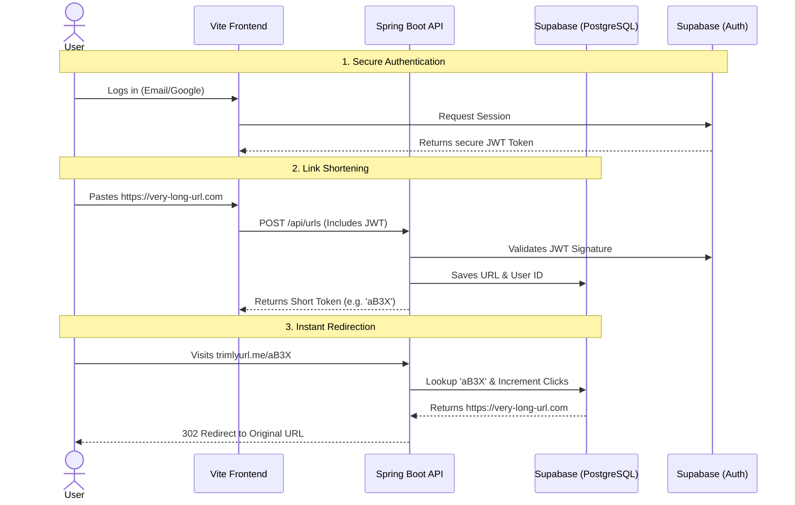

# ✂️ Trimly — URL Shortener

Trimly is a modern, full-stack URL shortener designed for speed and security. It takes long, unwieldy links and instantly converts them into clean, trackable short URLs.

---

## 🌊 Application Flow

Understanding how Trimly works under the hood:



---

## ✨ Core Features

*   **Lightning Fast Redirects:** Built on Spring Boot for highly concurrent, instant 302 redirects.
*   **Passwordless Security:** Eliminates password vulnerabilities by exclusively using Email OTPs and Google OAuth.
*   **Stateless Architecture:** The backend verifies cryptographically signed JWTs without storing sessions in memory.
*   **Analytics Tracking:** Each short link automatically tracks the number of times it has been clicked.
*   **Rate Limiting:** Protects the database from malicious bots by restricting the number of links created per minute using `Bucket4j`.
*   **Scalable Database:** Uses Supabase's managed PostgreSQL with properly normalized constraints.

---

## 🛠️ Technology Stack

| Component | Technology | Description |
| :--- | :--- | :--- |
| **Backend** | Spring Boot (Java 23) | Handles API requests, JWT validation, and high-speed redirects. |
| **Frontend** | Vite + Vanilla JS | A lightweight, fast-loading user interface with zero heavy frameworks. |
| **Database** | PostgreSQL | Hosted via Supabase, utilizing JPA/Hibernate for SQLi protection. |
| **Auth** | Supabase Auth | Provides secure OAuth and OTP login infrastructure. |

---

## 🚀 Quick Start Guide

Want to run Trimly on your own machine? Follow these steps:

### 1. Database Configuration
1. Create a [Supabase](https://supabase.com) project.
2. Open `src/main/resources/application.properties` in your IDE.
3. Plug in your database credentials:
   ```properties
   spring.datasource.url=jdbc:postgresql://db.[YOUR_ID].supabase.co:5432/postgres
   spring.datasource.password=[YOUR_DB_PASSWORD]
   spring.security.oauth2.resourceserver.jwt.jwk-set-uri=https://[YOUR_ID].supabase.co/auth/v1/.well-known/jwks.json
   ```
4. Run the Spring Boot server. It will start on `http://localhost:8080`.

### 2. Frontend Configuration
1. Open a terminal and navigate to the `frontend` folder.
2. Create a `.env` file and add your public keys:
   ```env
   VITE_SUPABASE_URL=https://[YOUR_ID].supabase.co
   VITE_SUPABASE_ANON_KEY=[YOUR_ANON_KEY]
   ```
3. Run `npm install` followed by `npm run dev`.
4. Open the localhost link provided by Vite to view the app!
